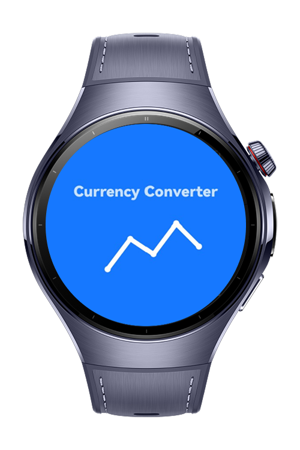
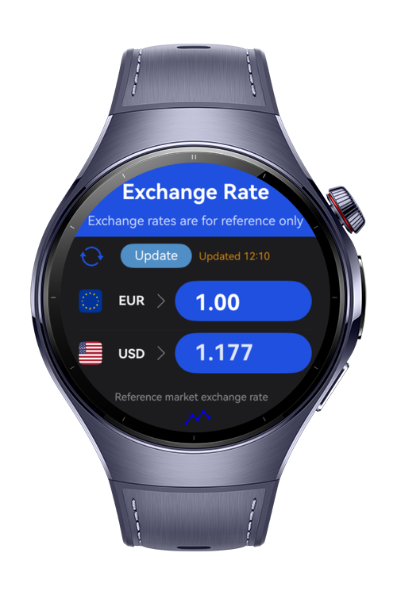
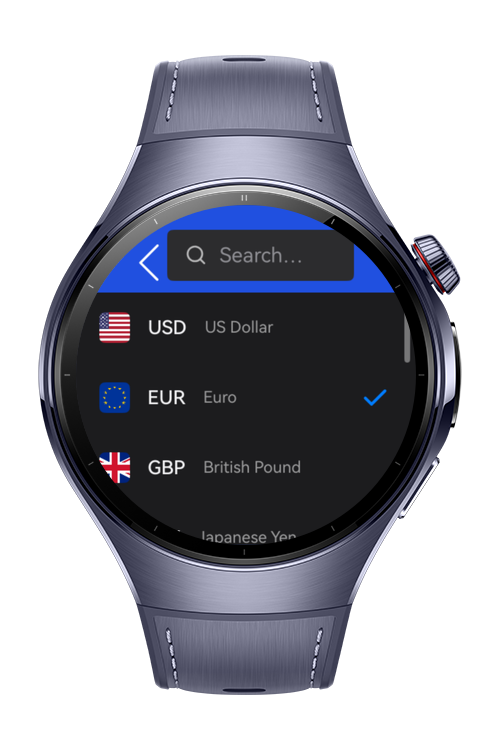
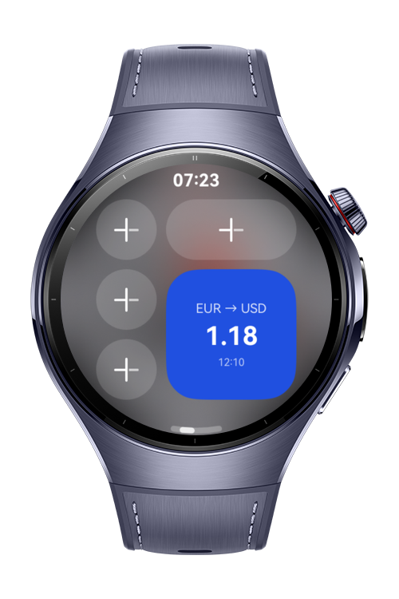

# Currency Converter

Currency Converter is a fully functional wearable watch application built for HarmonyOS NEXT wearable devices and developed using ArkTS. It lets users convert between 14 major currencies instantly through a minimal, glanceable interface optimised for small round watch screens. The app fetches live exchange rates online, caches the latest successful response for offline use, supports a home-screen rate tile, and locks to a dark theme for AMOLED comfort.

# Preview

<div>
  
  
  
  
</div>

# Use Cases

- Real-time currency conversion between major currencies such as USD, EUR, GBP, TRY, and more while traveling, shopping, or budgeting.
- Instant access on the wrist without reaching for a phone.
- Always up-to-date rates fetched over the internet and shown in a clean, quick-to-read format.
- One-tap currency selection; swap base and target instantly with the convert button.
- Offline resilience: the last successful rates are cached and reused when offline, with a stale-data indicator after one hour.
- Home-screen tile: a 2×2 widget shows the latest base-to-target rate and refreshes on tap.
- Recent currencies, the last entered amount, and the chosen pair are remembered across launches.
- 14 currency support.

# Tech Stack (Languages, Frameworks, Tools, Libraries, *3rd Party)

- ArkTS on HarmonyOS NEXT (Stage Model)
- @kit.ArkGraphics2D — common2D for RGBA colors; drawing for ColorFilter blend effects on icons
- @kit.RemoteCommunicationKit — rcp for HTTPS rate fetching with request timeouts
- @kit.NetworkKit — connection for offline detection
- @kit.ArkData — preferences for the rates/preferences cache
- @kit.SensorServiceKit — vibrator for haptic feedback
- @kit.FormKit — FormExtensionAbility for the home-screen widget
- @kit.LocalizationKit — i18n for the locale lock
- @ohos/hypium — local unit tests
- *Frankfurter API — free, public exchange-rate provider (no API key required)

# Directory Structure

```
entry/src/main/ets/
│
├── common/
│ ├── AppConstants.ets        // App-wide constants (endpoints, timings, defaults)
│ └── Haptics.ets             // Vibration feedback helper
│
├── services/
│ ├── CurrencyApi.ets         // Frankfurter network layer (fetch + connectivity)
│ └── RatesCache.ets          // Preferences-backed rates & preferences cache
│
├── viewmodel/
│ ├── CurrencyData.ets        // Currency model + Frankfurter response type
│ └── CurrencyViewModel.ets   // Currency data, search, conversion, rate update
│
├── pages/
│ ├── NavigationRouter.ets    // Navigation container & state provider
│ ├── SplashPage.ets          // Welcome page (tap to skip)
│ ├── ExchangePage.ets        // Main converter page
│ └── SelectCurrencyPage.ets  // Currency selection page
│
├── view/
│ ├── BaseCurrencyRow.ets     // Base currency input row
│ ├── TargetCurrencyRow.ets   // Target currency output row
│ ├── CurrencyItem.ets        // Currency list item
│ └── SearchBar.ets           // Search bar component
│
├── widget/
│ ├── EntryFormAbility.ets    // Home-screen rate tile provider
│ └── pages/
│   └── WidgetCard.ets        // Widget UI
│
├── entryability/
│ └── EntryAbility.ets        // App entry (locks dark theme + English locale)
│
└── entrybackupability/
  └── EntryBackupAbility.ets  // Backup extension ability
```

# Constraints and Restrictions

## Supported Devices

* Huawei Watch 5
* DevEco Studio Simulator

# License (MIT)

Currency Converter is distributed under the terms of the MIT License. See the [LICENSE](/LICENSE) for more information.
